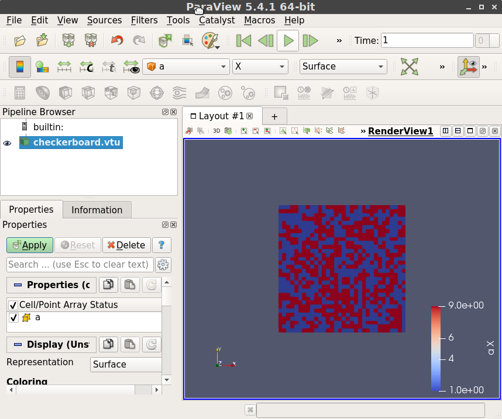
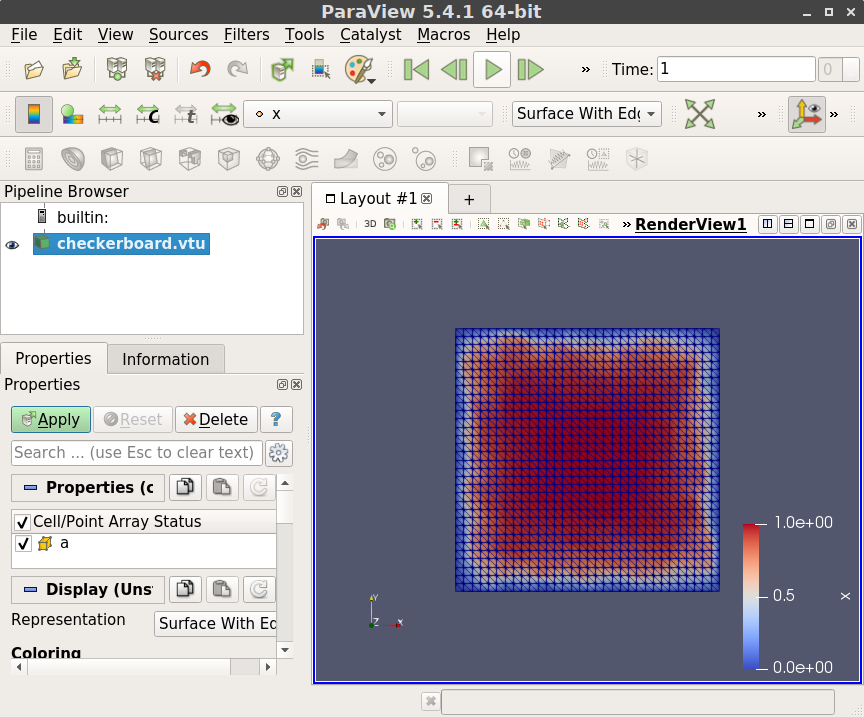
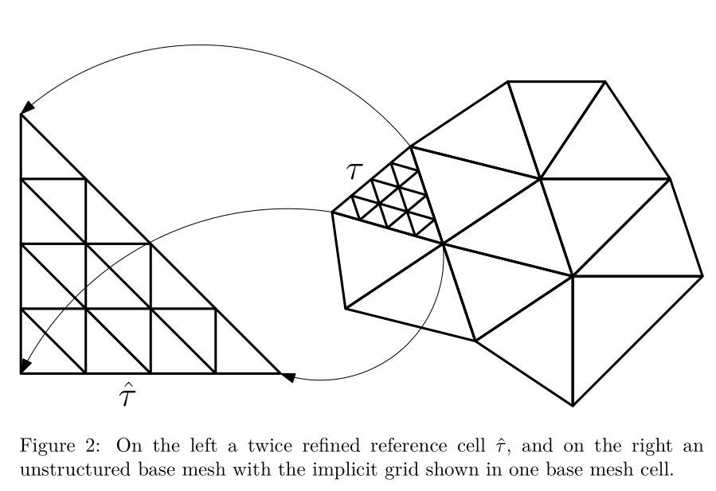
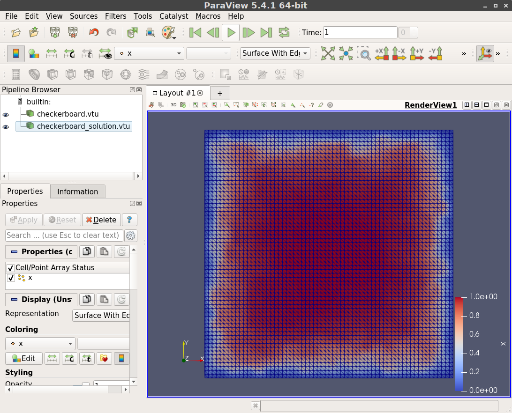

# Homogenization.jl

Consider the problem $$-\nabla \cdot a(x) \nabla u + \lambda u = f$$ in 2D and 3D where $a$ is a symmetric, positive definite matrix with piecewise constant coefficients in the domain $U \subset \mathbb{R}^{d}$ with $d = 2, 3,$ $\lambda > 0$ and $u = 0$ on $\partial U$.

## Base mesh
We will assume it is feasible to make a triangulation of $U$ such that $a$ is constant on each triangle or tetrahedron. For this we need a mesh

```@docs
Mesh
```

There are some helper functions as well to generate a simple mesh

```@docs
hypercube
```

Now we generate random conductivity parameters for each element of the base mesh.

```julia
using Homogenization
using Homogenization: conductivity_per_element, generate_conductivity

n = 32
base = hypercube(Tri{Float64}, n)
a = conductivity_per_element(base, generate_conductivity(base, n))
```

Next we could try to visualize the base mesh by exporting it to a file compatible
with [Paraview](https://www.paraview.org/). We store the value of `a` as vectorial
data for each element of the base mesh:

```julia
using WriteVTK
using Homogenization: dimension
vtk_grid("checkerboard", base) do vtk
    as_matrix = reshape(reinterpret(Float64, a), dimension(base), :)
    vtk_cell_data(vtk, as_matrix, "a")
end
```

which saves a file `checkerboard.vtu` in the current working directory. It should
look like



## Solving a "coarse" FEM problem

For the moment let's stick to a very coarse grid for the checkerboard as we have it with
just four nodes on the corners of each checkerboard cell (one node per cell). The weak form reads 

$$\int_U a \nabla u \cdot \nabla v + \lambda uv = \int fv.$$

for $u, v$ in the appropriate space, which we discretize by taking piece-wise linear elements for $u$ and $v.$ Let's take
$f = \lambda = 1.$

This is done as follows:

```julia
using Homogenization: assemble_checkerboard, assemble_vector
A = assemble_checkerboard(base, a, 1.0)
b = assemble_vector(base, identity)
```

The above does not take into account that $u$ is supposed to be zero at the boundary.
To impose the boundary condition we have to detect the boundary in the mesh first. 
This is rather simple:

```julia
using Homogenization: list_interior_nodes
interior = list_interior_nodes(base)
```

The boundary condition is simply imposed by partitioning the unknowns $x = \begin{bmatrix}x_i & x_b\end{bmatrix}^T$ such that the linear system reads:

$$\begin{bmatrix}A_{ii} & A_{ib} \\ A_{bi} & A_{bb}\end{bmatrix}\begin{bmatrix}x_i \\ x_b\end{bmatrix} = \begin{bmatrix}b_i \\ b_b\end{bmatrix}.$$ With the boundary nodes $x_b = 0$ this comes down to solving $A_{ii}x_i = b_i:$

```julia
using Homogenization: nnodes
A_int = A[interior, interior]
b_int = b[interior]
x_int = A_int \ b_int
x = zeros(nnodes(base))
x[interior] .= x_int
```

Finally we would like to visualize the FEM solution in Paraview, which is done as follows:

```julia
vtk_grid("checkerboard", base) do vtk
    as_matrix = reshape(reinterpret(Float64, a), dimension(base), :)
    vtk_cell_data(vtk, as_matrix, "a")
    vtk_point_data(vtk, x, "x")
end
```

And it will look more or less like



## Implicit refinement

The coarse FEM problem will have a large error as the coefficients are rough and the number
of nodes per checkerboard cell is approximately one. Therefore we wish to do $h$-refinement.
The assumption will be that we will not be able to store the fully refined grid (nodes and
elements) and neither the corresponding discrete operator (`A`).

The usual solution is then to use an iterative method to solve `A * x = b` and compute the entries of the discrete operator `A`  on demand (matrix-free). However, in our case the
coefficients of $a$ are supposed to be constant in each refined element, so we can do better. We refine a single reference triangle or tetrahedron, build local discrete operators and then map the refined reference element to each base mesh element.

### Reusing discrete operators of a single reference element



Suppose $\tau \subset U$ is a single element of the base mesh. We refine $\tau$ such that it has $N_f$ nodes. A local discretized operator takes the form

$$A_{ij}^\tau = \int_\tau a \nabla \phi_i \cdot \nabla \phi_j \, dx$$

where $\phi_i$ and $\phi_j$ are local basis functions ($i, j = 1, \dots, N_f$) and $a$ is a constant matrix by assumption. If we have some reference triangle or tetrahederon $\hat{\tau},$ the pullback to reference coordinates looks like

$$A_{ij}^\tau = \int_\hat{\tau} a J^{-1}\nabla \hat{\phi}_i \cdot J^{-1}\nabla \hat{\phi}_j |J| \, d\hat{x}$$

where $\hat{\phi}_i$ and $\hat{\phi}_j$ are the corresponding reference basis functions and $J$ is some matrix rotating and scaling the triangle or tetrahedron.

If we assume each base mesh element is refined the same way, then the only dependence on $\tau$ is in $J$ and the matrix $a$. We can save some computational work by computing $d^2$ matrices

$$\hat{A}_{ij}^{(k,\ell)} := \int_\hat{\tau}\frac{\partial \phi_i}{\partial \hat{x}_k}\frac{\partial \phi_j}{\partial \hat{x}_\ell} \, d\hat{x} \text{ for } i, j = 1, \dots, N_f$$

for $k, \ell = 1, \dots, d.$ This way the local operator $A^\tau$ takes the form

$$A^\tau = \sum_{k, \ell = 1}^d (J^{-T}aJ^{-1}|J|)_{k,\ell}\hat{A}^{(k,\ell)}.$$

So practically, for any base element $\tau,$ if we wish to work with the matrix $A^\tau$, we compute the mapping $J$ and the tiny matrix $J^{-T}aJ^{-1}|J|,$ and then reuse the matrices $\hat{A}^{(k,\ell)}$ which we have computed up front once and for all.

### Implicit grid & multigrid (high-level idea)
Let's refine the base grid $r$ times, so that we have $r + 1$ levels; level 1 has no refinements at all. We need a few things:

1. Suppose the base mesh has $N_e$ elements, and for a given level the refined reference element has $N_f$ nodes. For convenient numbering we store nodes on the boundary of a base mesh element multiple times, so a good way to represent the right-hand side $b$ and uknowns $x$ is a matrix of size $N_f \times N_e$.

2. Not only do we need to build the matrices $\hat{A}^{(k, \ell)}$, also do we have to build interpolation operators from level $k$ to $k + 1$. These will just be sparse matrices and we just need one on each level of the refined reference element.

3. To apply a "global" matrix-vector product with a discretized operator $A$, we will apply all local operators, which is sufficient for interior nodes of each base mesh element, but for nodes on the boundary of a base mesh element we have to make the data flow and sum the local values together.

4. We have to apply the Dirichlet zero boundary condition by zeroing out nodes on the boundary after multiplication.

5. Restricting a function from level $k + 1$ to $k$ is a completely local operation, but interpolating from $k$ to $k+1$ also requires summing values along the boundaries of all base mesh elements.

We want to accomplish 3, 4 and 5 without storing a global list of connectivity data (i.e. lists of nodes that coincide globally) cause that would run into excessive storage demands again. Rather it is done via a couple sparse mappings solely on the base mesh:

- From each node to each element (and its local node number);
- From each edge to each element (and its local edge number);
- From each face to each element (and its local face number) (only in 3D)

together with a local pre-computed listing of nodes on corners, the interior of edges and interior of faces of a simplex.

### Putting this into action

Let's build the above idea in code.

First we create a base mesh, which is the coarsest mesh of multigrid:

```julia
using SparseArrays, LinearAlgebra
using Homogenization: generate_conductivity, conductivity_per_element, 
                      list_interior_nodes, assemble_checkerboard,
                      nnodes, BaseLevel

elementtype = Tri{Float64} # or Tet{Float64}
n = 32
base = hypercube(elementtype, n)
a = conductivity_per_element(base, generate_conductivity(base, n))
λ = 1.0
interior = list_interior_nodes(base)
F = cholesky(assemble_checkerboard(base, a, λ)[interior,interior])
base_level = BaseLevel(Float64, F, nnodes(base), interior)
```

`BaseLevel` stores a factorized version of the coarse operator and also allocates a vector
`b` and `b_intererior`. It has all data to efficiently solve a coarse problem with a direct method (it does not pre-allocate a vector `x` for technical reasons).

Now we start working on the implicit grid. We construct many of the things of the previous section in a single call:

```julia
using Homogenization: ImplicitFineGrid
refinements = 3
implicit = ImplicitFineGrid(base, refinements)
```

In the REPL this will print a bit of information about the implicit grid, e.g.:

```julia
julia> implicit
Implicit grid of cell type Tri{Float64}. Base mesh has 1089 nodes and 2048 elements. Finest level (3) has 15 nodes and 16 elements. In total at most 30720 unknowns.
```

It reads "In total _at most_ 30720 unknowns" since this is the product $N_e * N_f = 2048 * 15$ where nodes on the boundaries of the base mesh are counted multiple times. (The level numbering in the message might be off by one -- it's the grid after the third refinement).

The `ImplicitFineGrid` type collects a lot of things:

```julia
julia> implicit.base # refernece to the base mesh
julia> implicit.interfaces.nodes # sparse map from nodes -> connected element + local id
julia> implicit.interfaces.edges # sparse map from edges -> connected element + local id
julia> implicit.interfaces.faces # sparse map from faces -> connected element + local id
julia> implicit.reference.interops # array of interpolation operators from level to level
julia> implicit.reference.numbering # local numbering of corners, edge and face nodes
julia> implicit.reference.levels # mesh for each level of the refined reference element
```

Next, to be able to impose the boundary condition we have to have sparse mappings from the nodes, edges and faces of base mesh elements touching the boundary:

```julia
using Homogenization: list_boundary_nodes_edges_faces, ZeroDirichletConstraint
nodes, edges, faces = list_boundary_nodes_edges_faces(implicit.base)
constraint = ZeroDirichletConstraint(nodes, edges, faces)
```

Finally we can build the $A^{(k,\ell)}$ operators:

```julia
using Homogenization: build_local_diffusion_operators, build_local_mass_matrices,
                      L2PlusDivAGrad
diff_terms = build_local_diffusion_operators(implicit.reference)
mass_terms = build_local_mass_matrices(implicit.reference)
level_operators = map(zip(diff_terms, mass_terms)) do op
    diff, mass = op
    L2PlusDivAGrad(diff, mass, constraint, λ, a)
end
```

So `level_operators` is now an array of these operators for each level of the grid. It has all the values it needs: the value of $\lambda$, the conductivity $a$ per base mesh element and the information to zero out boundary nodes.

Next, we allocate the vectors we need for multigrid (for convenience we shape them as matrices as explained above).

```julia
using Homogenization: LevelState, refined_mesh, nelements, nnodes, base_mesh
level_states = map(1 : refinements) do i
    mesh = refined_mesh(implicit, i)
    LevelState(nelements(base_mesh(implicit)), nnodes(mesh), Float64)
end
```

A `LevelState` contains just the arrays we need: an approximation to the unknown `x`, a right-hand side `b`, and a residual `r`. We have to have these vectors on every level. These are the only arrays that have a large memory footprint, so that's why we allocate them once and for all!

```julia
julia> size(level_states[end].x)
(15, 2048)
```

Finally we have to set up the problem. We still have to set up a right-hand side. The
right-hand should be constructed _locally_. For instance:

```julia
using Homogenization: local_rhs!
finest_level = level_states[end]
local_rhs!(finest_level.b, implicit) # integrate v dx locally
```

Note that `local_rhs!` does not accept a functional currently, but this function is very simle and can be written by the user basically. Currently it is just hard-coded to use $f = 1$.

Then, we take an initial guess $x$, this vector should be constructed _globally_ and should satisfy the boundary condition:

```julia
using Homogenization: broadcast_interfaces!, apply_constraint!
using Random
rand!(finest_level.x) # local values
broadcast_interfaces!(finest_level.x, implicit, refinements) # sum boundaries
apply_constraint!(finest_level.x, refinements, constraint, implicit) # impose b.c.
```

Our initial guess resides in `finest_level.x` and should of course be nonzero

```julia
julia> finest_level.x
15×2048 Array{Float64,2}:
...
```

Now we can run multigrid iterations:

```julia
using Homogenization: vcycle!, zero_out_all_but_one!

ωs = [.02,.02,.02,.02] # constants in Richardson iteration / smoothing step per level
smoothing_steps = 1

for i = 1 : 100
    vcycle!(implicit, base_level, level_operators, level_states, ωs, refinements, smoothing_steps)

    zero_out_all_but_one!(finest_level.r, implicit, refinements)
    @info "After cycle $i" norm(finest_level.r)
end
```

Unfortunately some constants are chosen by hand currently :(. Running this, the output should be something like:

```julia
...
┌ Info: After cycle 98
└   norm(finest_level.r) = 0.0005182895775368055
┌ Info: After cycle 99
└   norm(finest_level.r) = 0.00047190444233626385
┌ Info: After cycle 100
└   norm(finest_level.r) = 0.00042970384073489823
```

Note that computing the norm is done with a hack: we zero out all values of repeated nodes and then take the Euclidean norm.

Finally, we might wish to see what the approximate solution looks like. In our case we can still easily store the full grid as the problem is rather small, but in real applications we might not be able to export the full grid. 

What we can do quite easily is to extract the approximate solution on a certain level. We have to select the values of `x` on the finest grid, but only those that appear on a coarser level. Fortunately by convention upon refinement new implicit nodes are appended to the back to the nodes array, which means that we can just extract the first so-many rows of `x` if we want to have the approximate solution on a coarser grid.

For example:

```julia
using Homogenization: construct_full_grid, nnodes, refined_mesh
using WriteVTK 

# Construct a full mesh compatible with Paraview (nodes are repeated here as well!)
save = 2
full_mesh = construct_full_grid(implicit, save)

vtk_grid("checkerboard_solution", full_mesh) do vtk
    x_on_level = reshape(finest_level.x[1 : nnodes(refined_mesh(implicit, save)), :], :)
    vtk_point_data(vtk, x_on_level, "x")
end
```

It saves the file `checkerboard_solution.vtu` and should roughly look like



where we look at level `2` with a single refinement.

